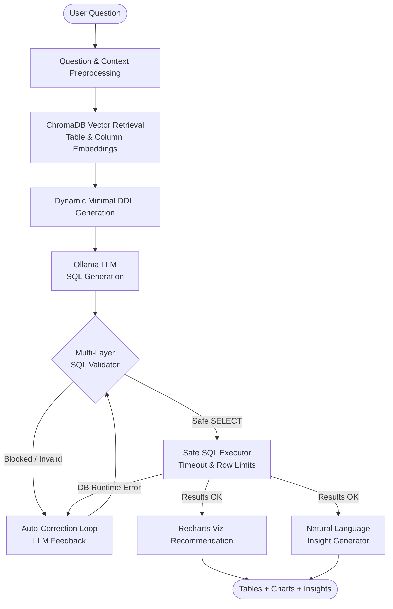

# QueryAI — Architecture & Technical Design

## 1. System Overview

**QueryAI** is an enterprise-grade AI analytics assistant that translates natural-language business questions into safe, highly optimized SQL queries, executes them against a relational data warehouse, and produces interactive visualizations and automated executive summaries.

---

## 2. Core Components

### 2.1 Multi-Layer SQL Security Validator (`app/security/sql_validator.py`)
- **Blocklist Pre-check**: Fast regex and keyword inspection blocking destructive operations (`DROP`, `DELETE`, `UPDATE`, `INSERT`, `ALTER`, `TRUNCATE`, `GRANT`, `REVOKE`, etc.).
- **AST Parsing with `sqlglot`**: Parses SQL into an Abstract Syntax Tree (AST) to ensure the query is strictly an `exp.Select` statement. Rejects multi-statement injections and nested write expressions.
- **Query Complexity Guard**: Restricts maximum join count to prevent denial-of-service and uncontrolled Cartesian products.

### 2.2 Schema-Aware Vector RAG (`app/ai/rag.py`)
- Extracts table schemas, column types, descriptions, primary keys, and foreign-key relationships.
- Generates dense vector embeddings using `nomic-embed-text` and stores them in ChromaDB.
- At query time, computes cosine similarity between user question and table schemas to retrieve only relevant tables, drastically reducing prompt token overhead.

### 2.3 SQL Generator & Auto-Corrector (`app/ai/sql_generator.py` & `app/ai/sql_corrector.py`)
- Specialized system and human prompt templates with strict SQL rules.
- If a query fails either security validation or database execution, the auto-corrector passes the error message, original query, and table DDL back to the LLM to generate an amended query within a configurable retry limit (`sql_max_retries = 2`).

### 2.4 Visualization & Executive Insights (`app/ai/insights.py`)
- Analyzes result columns, data types, cardinality, and temporal characteristics.
- Selects the ideal chart format:
  - **KPI Card**: Single-metric aggregates (e.g., total revenue).
  - **Line Chart**: Time-series trends (dates, months, quarters).
  - **Bar Chart**: Categorical comparisons across departments, regions, or products.
  - **Pie / Donut**: Proportions across a small set of categories.
  - **Interactive Table**: Multi-column detailed datasets.
- Generates concise 2-4 sentence executive insights highlighting key business takeaways.

---

## 3. Database Layer

- **Metadata Engine (`app_engine`)**: Stores query history, user sessions, generated SQL, execution metrics, and visualizations.
- **Analytics Database (`biz_engine`)**: Read-only connection to the business database containing analytical tables:
  - `customers`
  - `products`
  - `categories`
  - `orders`
  - `order_items`
  - `employees`
  - `regions`

---

## 4. API Endpoints

| Method | Endpoint | Description |
|---|---|---|
| `POST` | `/api/v1/query` | Complete Text-to-SQL pipeline with viz & insights |
| `POST` | `/api/v1/query/validate` | Dry-run SQL security validation |
| `POST` | `/api/v1/query/explain` | Beginner-friendly explanation of SQL logic |
| `GET` | `/api/v1/schema` | Complete schema metadata overview |
| `GET` | `/api/v1/schema/{table}` | Schema details for a specific table |
| `POST` | `/api/v1/schema/index` | Trigger schema vector indexing in ChromaDB |
| `GET` | `/api/v1/history` | Paginated query history with execution stats |
| `GET` | `/api/v1/system/status` | System health check (DB, Ollama, ChromaDB) |
